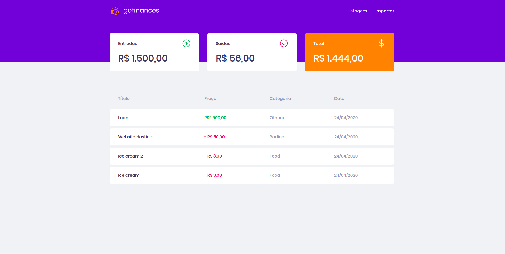
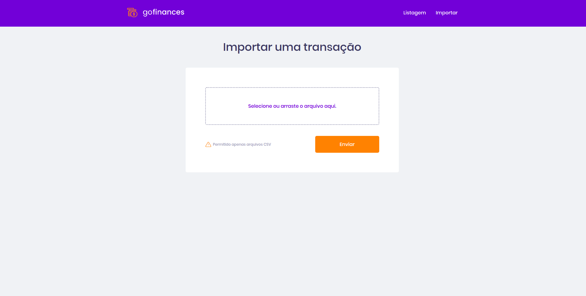

<h1 align="center">
# GoFinances Web
   
  
     
  
</h1>

# Indice
- [React](#-React)
- [Tecnologias utilizadas](#-Tecnologias-utilizadas)

---

## Tecnologias utilizadas

O projeto foi desenvolvido utilizando as seguintes tecnologias

- ReactJS
- Axios
- TypeScript
- React-Dropzone
- Filesize
- Styled-Components
- Date-fns
- History
- Polished
- ReactIcons

---

# Iniciar o projeto
  $ yarn start

  
**Desenvolvido por** [rebecag.com](https://www.rebecag.com/)